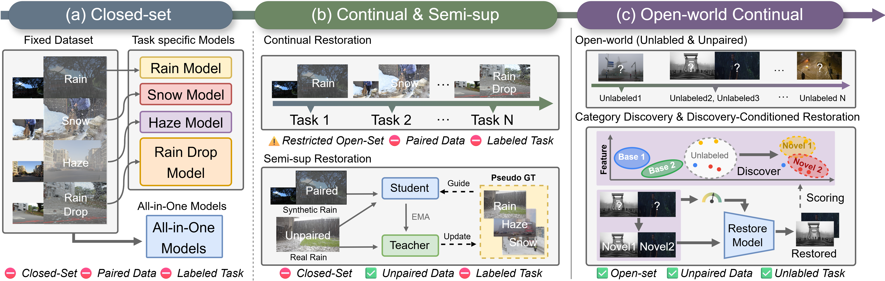
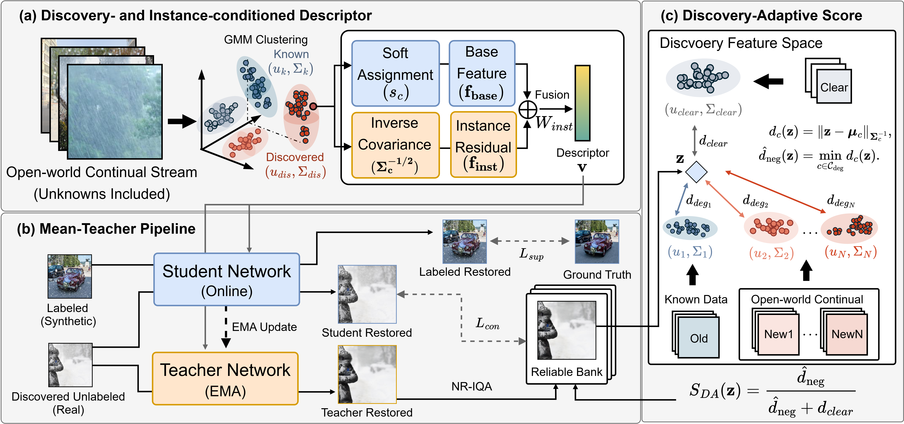

# DUDA

Official PyTorch implementation of **Discovering Unseen Degradations to Adapt
Open-World Image Restoration** (**NeurIPS 2026**).

DUDA discovers emerging degradations in unlabeled image streams and uses the
discovered structure to guide restoration, adapting to unknown and mixed
degradations without paired clean targets for the incoming data.

[[Project page]()]
[[Live demo]()]
[[Paper]()]
[[CCDD-11 dataset]()]
[[Pretrained models]()]

## Problem setting

**Open-world continual image restoration.** Starting from a model trained on
known degradations, the goal is to continually restore incoming images whose
degradations may be unknown, mixed, and changing over time. These streams
provide neither degradation labels nor paired clean targets. The model must
discover emerging degradation patterns and use that knowledge to adapt its
restoration behavior.



*From predefined restoration tasks to unlabeled open-world streams: DUDA couples
novel degradation discovery with adaptive restoration.*

The setting brings together three challenges: discovering **unknown and mixed
degradations**, learning from **unpaired real-world images**, and mitigating
**degradation composition bias**, where adaptation remains biased toward the
base degradation distribution.

## Method



DUDA connects continual category discovery to image restoration through two
proposed components, integrated into a mean-teacher adaptation pipeline:

- **Discovery- and instance-conditioned descriptor.** Soft assignments over
  known and discovered degradation clusters combine prototype-initialized
  embeddings with covariance-normalized instance residuals. The resulting
  descriptor conditions restoration on both degradation structure and the
  characteristics of each image.
- **Discovery-adaptive score.** Relative Mahalanobis distances to an anchored
  clear cluster and the nearest degradation cluster provide a degradation-aware
  signal for pseudo-target selection. Together with no-reference image quality
  assessment, this score refines the reliable bank and mitigates degradation
  composition bias.
- **Mean-teacher adaptation.** An EMA teacher supplies candidate pseudo-targets
  for unpaired real images. The student learns from paired base data and reliable
  pseudo-targets, using the discovery-conditioned descriptor to guide restoration.

## TODO

- [ ] Add the paper link and citation information.
- [ ] Verify the setup and run instructions from a fresh checkout in the target environment.

## Installation

The reference training environment uses Python 3.11, PyTorch 2.4.0,
torchvision 0.19.0, Transformers 4.56.0, PEFT 0.12.0, and PyIQA 0.1.14.1.
Create an environment, install PyTorch, and then install the project dependencies:

```bash
conda create -n duda python=3.11 -y
conda activate duda
python -m pip install torch==2.4.0 torchvision==0.19.0 torchaudio==2.4.0 --index-url https://download.pytorch.org/whl/cu121
python -m pip install -r requirements.txt
```

The default training configuration uses three CUDA GPUs. BOFT requires a CUDA
toolkit and a C++ compiler.

## Data and pretrained assets

Datasets and checkpoints are not included in this repository. Connect local
copies using the asset-link helper:

```bash
python scripts/link_assets.py \
  --data /path/to/wres_datasets \
  --features /path/to/feature_root \
  --dino-base /path/to/dinov3-vitl16 \
  --dino-adapter /path/to/dinov3-vitl16-sl/checkpoint \
  --cgcd /path/to/cgcd/saved_models \
  --stage0 /path/to/stage0_epoch500.pth \
  --adapted /path/to/semi_supervised_epoch10.pth
```

Each argument is optional, so assets can be linked as they become available.
The helper creates links under `assets/` without copying the source files.

The dataset root should contain:

```text
assets/data/
├── syn_train_dataset/       # Paired base data and split manifests
├── real_train_dataset/      # Unpaired real images for discovery
├── real_train_patches/      # Precomputed 224-pixel patches for adaptation
├── real_eval_dataset/       # Full real-world evaluation sets
└── real_eval_small_dataset/ # Subset used during adaptation
```

Keep the existing train/test split manifests. The feature root must contain
`wres_with_clear/dinov3-vitl16-sl/`. The CGCD asset directory must contain the
PCA model, scaler, class mapping, and stage Gaussian parameter files.

| Asset | Role |
| --- | --- |
| DINOv3 base model and learned adapter | Degradation feature extraction |
| Feature files and CGCD parameters | Category discovery and restoration conditioning |
| `stage0_epoch500.pth` | Supervised initialization for adaptation |
| `semi_supervised_epoch10.pth` | Adapted checkpoint for teacher evaluation |

## Training

Run all commands from the repository root. The launcher writes generated assets,
checkpoints, logs, and resolved configurations under `outputs/` by default.

### 1. Degradation discovery

Learn degradation features and extract features for the unlabeled real images:

```bash
python scripts/run.py features
```

Fit VB-CGCD using the generated features:

```bash
FEATURE_ROOT="$PWD/outputs/features" python scripts/run.py cgcd
```

Before restoration training, link the generated feature root, DINO adapter, and
CGCD parameters into `assets/` with `scripts/link_assets.py`, or set
`FEATURE_ROOT`, `DINO_ADAPTER_DIR`, and `CGCD_DIR` to their locations. See
[the reproduction stages](experiment.md) for output directories.

### 2. Supervised initialization

Train the restoration model on paired base data for 500 epochs:

```bash
python scripts/run.py supervised
```

The training configuration is defined in [`configs/supervised.yml`](configs/supervised.yml).

### 3. Open-world adaptation

Starting from the supervised checkpoint linked as `assets/checkpoints/stage0_epoch500.pth`,
run semi-supervised adaptation for 10 epochs:

```bash
python scripts/run.py semi_supervised
```

Use `STAGE0_CHECKPOINT=/path/to/checkpoint.pth` to select a different initialization.
The adaptation configuration, including the reliable bank and pseudo-target
selection settings, is defined in [`configs/semi_supervised.yml`](configs/semi_supervised.yml).

Select GPUs with `CUDA_VISIBLE_DEVICES` and set `NPROC_PER_NODE` to the number
of GPU processes (default: `3`). `DATA_ROOT`, `OUTPUT_ROOT`, and `EXP_NAME`
can also be overridden. To resume an interrupted run, set `RESUME_CHECKPOINT`;
adaptation also requires the matching pseudo-label bank.

Inspect any stage's command and resolved configuration before launching:

```bash
python scripts/run.py semi_supervised --dry-run
```

## Evaluation

Evaluate the adapted teacher on **RealRain-2320, RTTS, and Snow100K-R**:

```bash
python scripts/run.py evaluate
```

By default, evaluation loads `assets/checkpoints/semi_supervised_epoch10.pth`
and saves restored images and metrics under `outputs/results/table1/`. Set
`CHECKPOINT` to evaluate another checkpoint, or `RESULTS_ROOT` to change the
output directory.

### Q-Align

Q-Align requires a separate environment because its model code uses an older
Transformers version than DINOv3. The tested environment uses Python 3.10,
PyTorch 2.1.2, torchvision 0.16.2, Transformers 4.37.2, and PyIQA 0.1.14.1:

```bash
conda create -n duda-qalign python=3.10 -y
conda activate duda-qalign
python -m pip install torch==2.1.2 torchvision==0.16.2 --index-url https://download.pytorch.org/whl/cu121
python -m pip install -r requirements-qalign.txt
export QALIGN_PYTHON="$(which python)"
conda activate duda
NPROC_PER_NODE=1 python scripts/run.py qalign
```

This stage scores the restored images saved by the evaluation command. Use the
same `RESULTS_ROOT` for both stages if you override the default location.

## Acknowledgements

DUDA builds on VB-CGCD for continual category discovery, OneRestore for the
restoration backbone, and the mean-teacher framework of Semi-UIR. We thank the
authors and the open-source community for their contributions.

See [`THIRD_PARTY.md`](THIRD_PARTY.md) for upstream components and their
applicable terms.
